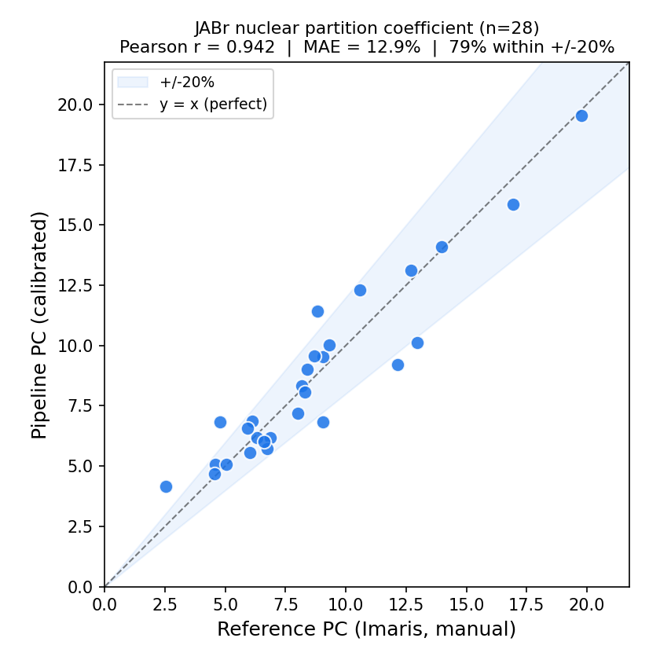

# Condensate Partition Coefficient Pipeline

Automated 3D segmentation of nuclear biomolecular condensates and measurement of
their **partition coefficient (PC)** from confocal Z-stacks — a from-scratch
replacement for the manual Imaris workflow.

> **Franco Lab · UCLA · Spring 2026**
> Author: Daniel Chang
> Principal Investigator: Elisa Franco

| | |
|---|---|
| **Inputs** | A two-channel confocal Z-stack (channel 0 = nuclei, channel 1 = condensate) |
| **Outputs** | Nuclear & cytoplasmic PC, 3D condensate/nuclei masks, per-object volumes, a summary figure |
| **Validated on** | **JABr** construct: Pearson **r = 0.942**, MAE **12.9 %**, **79 %** of cells within ±20 % of the manual reference (n = 28) |
| **Interfaces** | Point-and-click **GUI** (`run_gui.py`) or scriptable **CLI** (`pipeline.py`) |



---

## What this does

For each cell, the pipeline reproduces the Fabrini et al. partition-coefficient
measurement automatically:

1. **Denoise** both channels (Cellpose 3 `denoise_cyto3`).
2. **Segment nuclei** in 3D (Cellpose 3 `cyto3`), clean fragments, and fill the
   "donut holes" that condensates carve out of the nuclear stain.
3. **Detect condensates** with Laplacian-of-Gaussian spot detection (`blob_log`),
   keeping a spot as *intra-nuclear* when ≥ 50 % of its volume lies inside a nucleus.
4. **Measure the PC** = condensed-phase density ÷ dilute-phase density
   (both camera-background-subtracted), then apply a per-construct **calibration**
   that standardizes the automated value onto the manual Imaris scale.

See **[docs/METHODS.md](docs/METHODS.md)** for the full method, the rationale
behind each step, and an honest account of where it does and does not work.

---

## Install

```bash
# 1. Install PyTorch for your machine (CPU or CUDA) from https://pytorch.org/get-started/locally/
#    e.g. CUDA 12.1:
#    pip install torch --index-url https://download.pytorch.org/whl/cu121

# 2. Install the rest
pip install -r requirements.txt
```

Cellpose downloads its model weights (`cyto3`, `denoise_cyto3`) automatically on
first run. A GPU is recommended (~10–15 s/cell); CPU works but is slower.

---

## Quickstart

### Option A — GUI (recommended for lab use)

```bash
python run_gui.py
```

1. **Single File** tab → browse to your two-channel `.tif`.
2. **Settings** → set **Construct = JABr** (this auto-selects the `blob_log`
   detector and the JABr calibration).
3. Click **▶ Run Pipeline**. Results stream to the log and are saved to your
   chosen output folder.

Full walkthrough with screenshots: **[docs/MANUAL.md](docs/MANUAL.md)**.

### Option B — CLI (one bundled sample included)

```bash
python pipeline.py --roi sample_data/JABr_Sample2_5_3.tif --construct JABr --output my_output
```

Expected result for the bundled sample (`JABr_Sample2_5_3.tif`):

```
[nuclear] PC raw 4.867  →  calibrated 4.813     (manual reference: 4.558,  +5.6 %)
```

The curated output of this exact run is in
[`sample_data/example_output/`](sample_data/example_output/) so you can compare.

---

## Repository layout

```
pipeline.py                 Core pipeline + CLI (load → denoise → segment → measure PC)
run_gui.py                  Tkinter GUI (Single File + Batch tabs)
outputs/calibration_table.json   Per-construct calibration (raw PC → reference scale)
sample_data/
  JABr_Sample2_5_3.tif      One bundled JABr ROI for the walkthrough
  example_output/           Curated output of the quickstart run
docs/
  MANUAL.md                 In-depth instruction manual (GUI + CLI)
  METHODS.md                The science: PC formula, calibration, scope & limits
  TIMELINE.md               Research history (Winter → Spring 2026)
  figures/                  Pipeline diagram + validation scatter
```

---

## Scope & honest limits

This tool is **production-ready for the JABr construct** and is intended to be
run with a human in the loop (glance at the saved masks). It is **construct-specific**:
the condensate detector was tuned on JABr morphology and does not transfer to
other constructs as-is. A leave-one-construct-out experiment confirmed that a
single detector does not generalize zero-shot. The full evidence and the path to
extending it (per-construct calibration, few-shot retraining) are documented in
**[docs/METHODS.md](docs/METHODS.md) → Scope and generalization**.
