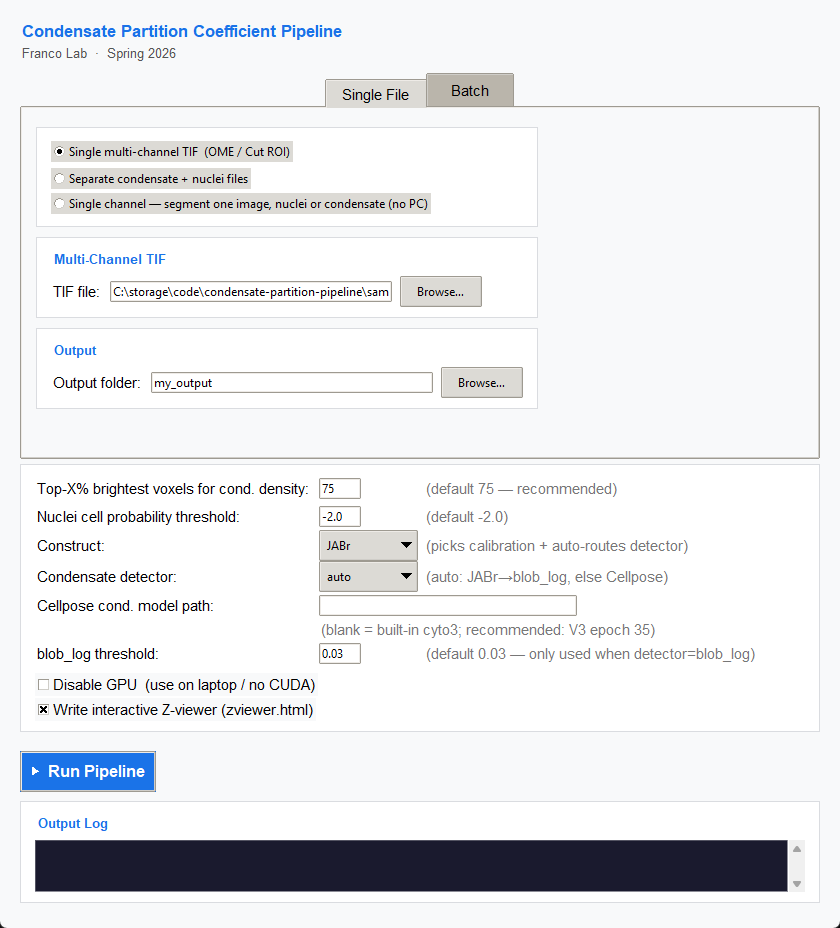
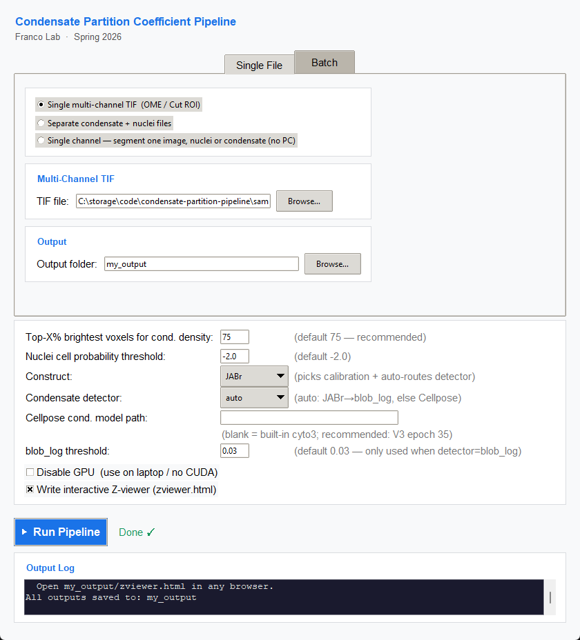
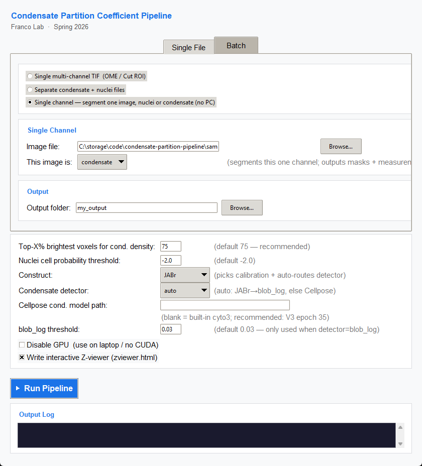
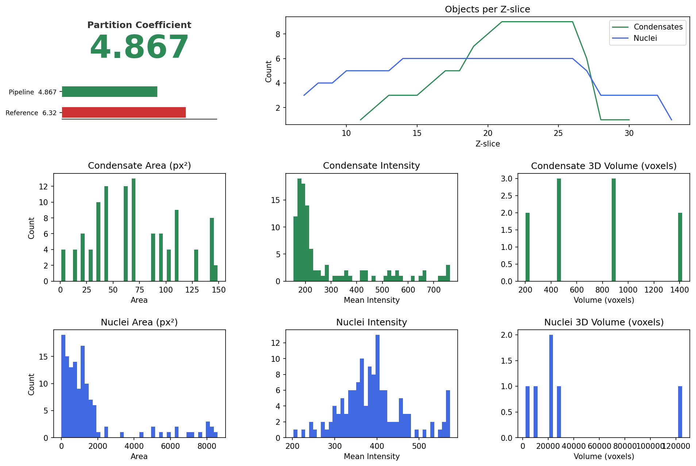

# Instruction Manual — Condensate Partition Coefficient Pipeline

**Franco Lab · UCLA · Spring 2026**
Author: Daniel Chang · Principal Investigator: Elisa Franco

This manual explains how to install, run, and interpret the condensate
partition-coefficient pipeline using the **web app**, the **graphical interface
(GUI)**, or the **command line (CLI)**. No coding experience is needed for the
web app or GUI paths.

---

## Contents

1. [What you need before you start](#1-what-you-need-before-you-start)
2. [Installation (one time)](#2-installation-one-time)
3. [Preparing your image files](#3-preparing-your-image-files)
4. [Running with the web app](#4-running-with-the-web-app)
5. [Running with the GUI](#5-running-with-the-gui)
6. [Understanding the settings](#6-understanding-the-settings)
7. [Reading the outputs](#7-reading-the-outputs)
8. [Batch mode — many cells at once](#8-batch-mode--many-cells-at-once)
9. [Running from the command line](#9-running-from-the-command-line)
10. [Troubleshooting](#10-troubleshooting)
11. [Quick reference card](#11-quick-reference-card)

---

## 1. What you need before you start

- A **Windows, macOS, or Linux** computer. A computer with an **NVIDIA GPU** is
  strongly recommended (≈10–15 s per cell). Without a GPU it still works, just
  slower (a minute or more per cell).
- **Python 3.10 or 3.11** installed.
- Your microscopy data as **two-channel confocal Z-stacks** in TIFF format:
  - **Channel 0 = nuclei** stain
  - **Channel 1 = condensate** signal

If your data is the same "Cut ROI" format used in the lab's Box folder, you are
already set — those files are read directly.

---

## 2. Installation (one time)

Open a terminal (PowerShell on Windows) in the project folder and run:

```bash
# Step 1 — install PyTorch for your machine.
#   Pick the command from https://pytorch.org/get-started/locally/
#   Example for an NVIDIA GPU with CUDA 12.1:
pip install torch --index-url https://download.pytorch.org/whl/cu121
#   For a laptop with no GPU, the plain CPU build:
pip install torch

# Step 2 — install everything else
pip install -r requirements.txt
```

The first time you run the pipeline, Cellpose downloads its AI model weights
automatically (a one-time ~100 MB download). After that it works offline.

**Verify it works** by running the bundled sample (see section 9). If you get a
partition coefficient near **4.8**, your installation is correct.

---

## 3. Preparing your image files

The pipeline accepts two input shapes:

| Your data looks like… | Use this |
|---|---|
| One `.tif` file containing **both** channels (e.g. a Cut ROI / OME-TIFF) | **Single multi-channel TIF** mode |
| Two separate `.tif` files — one nuclei, one condensate | **Separate files** mode |

Channel order matters: **channel 0 must be the nuclei**, **channel 1 the
condensate**. The pipeline auto-detects most axis orderings (ZCYX, CZYX, etc.),
but if results look wrong, the most common cause is swapped channels.

---

## 4. Running with the web app

The web app is the most integrated way to use the pipeline: you **configure,
run, and view results in a single browser page**, for both single cells and
whole batches. Launch it:

```bash
python webapp.py
```

It prints a link and opens `http://127.0.0.1:5000` automatically. The page has
two halves: a **configuration panel** on the left and a **viewer panel** on the
right.

### Single cell

1. Under **Input**, choose **Single multi-channel TIF** (or separate channels /
   single-channel). Click **Browse** to pick your file — this opens an in-app
   file browser that navigates your computer's folders (no uploading).
2. Set an **Output folder** (defaults to `outputs/web_run`).
3. In **Settings**, set **Construct = JABr**.
4. Click **▶ Run Pipeline**. The **Output log** streams live progress, and the
   status line shows the final PC.
5. When it finishes, the interactive **Z-viewer loads in the right panel** — the
   same viewer described in [section 7](#7-reading-the-outputs), embedded in the
   page. Scroll slices with the slider or arrow keys.

### Batch (a folder of cells)

1. Choose the **Batch — a folder of TIFs** input mode.
2. **Browse** to the folder of `.tif` files. Optionally pick a **Reference CSV**
   (manual Imaris nuclear PCs) to also get correlation metrics.
3. Run. Each cell becomes a **clickable chip** above the viewer showing its
   calibrated PC; click a chip to load that cell's Z-viewer in the panel. If a
   reference CSV was supplied, the **r / RMSE / MAE** metrics appear on the right.

> The web app currently covers everything the GUI does. The Tkinter GUI
> (next section) remains available if you prefer a native desktop window.

---

## 5. Running with the GUI

Launch it:

```bash
python run_gui.py
```

A window titled **"Condensate Pipeline"** opens with two tabs: **Single File**
and **Batch**.



*The Single File tab with a multi-channel TIF loaded and Construct = JABr.*

### Step-by-step (single cell)

1. Stay on the **Single File** tab.
2. Under **Input Mode**, choose:
   - **"Single multi-channel TIF"** if your file has both channels (most common), then **Browse…** to it; or
   - **"Separate condensate + nuclei files"** and select each file.
3. Under **Output**, pick a folder for the results (optional — defaults to
   `outputs/`).
4. In the **Settings** card, set **Construct = JABr** (see section 6 for what
   each setting does). For JABr, leave everything else at its default.
5. Click **▶ Run Pipeline**. The right-hand **Output Log** shows live progress
   through the 6 steps. The status turns **"Done ✓"** when finished.
6. Open your output folder to see the masks, tables, and `results.png`.



*After the run, the Output Log reports the calibrated partition coefficient (here 4.813) and the status reads **Done ✓**.*

### Single-channel mode — segment just one image

Sometimes you have only **one** channel — a condensate image *or* a nuclei image —
and just want it segmented (e.g. to get masks, object counts, and volumes). Choose
the third input mode, **"Single channel"**, then pick whether the image is
**condensate** or **nuclei**:



- **Nuclei** → segmented with Cellpose `cyto3` (same as the full pipeline).
- **Condensate** → uses the same detector the full pipeline would (for `JABr`,
  `blob_log`); since there is no nuclei channel, the intra-nuclear gate is turned
  off, so **every** detected condensate is kept.

Outputs are `<channel>_masks.tif`, `<channel>_volumes.csv`,
`<channel>_measurements.csv`, and a `summary.csv` with the object count. **No
partition coefficient is produced** — the PC needs both a condensate and a nuclei
channel.

---

## 6. Understanding the settings

The **Settings** card controls how the pipeline runs. For routine JABr analysis
you only need to set **Construct**; the rest have sensible defaults.

| Setting | Default | What it does |
|---|---|---|
| **Construct** | `(none)` | Pick **`JABr`** for the validated workflow. This **auto-selects** the `blob_log` detector **and** applies the JABr calibration so the reported PC is on the manual reference scale. Leaving it `(none)` gives a raw, uncalibrated PC. |
| **Condensate detector** | `auto` | `auto` routes JABr → `blob_log`, anything else → Cellpose. You normally leave this on `auto`. |
| **Top-X % brightest voxels** | `75` | Defines the condensed-phase density. Cellpose/blob masks include a dim halo; using the brightest 75 % of mask voxels removes that fluff and matches the manual reference. **Leave at 75.** |
| **Nuclei cell-probability threshold** | `-2.0` | How aggressively nuclei are detected. Lower = merges more into whole nuclei. `-2.0` works well for the lab's nuclear stain. |
| **blob_log threshold** | `0.03` | Sensitivity of condensate spot detection (only used when detector = `blob_log`). Lower finds dimmer spots; higher is stricter. **Leave at 0.03 for JABr.** |
| **Cellpose cond. model path** | *(blank)* | Advanced: a fine-tuned Cellpose model for condensates. Leave blank to use the built-in model. Not needed for JABr. |
| **Disable GPU** | off | Tick this on a laptop with no NVIDIA GPU. |
| **Write interactive Z-viewer** | on | Writes a self-contained `zviewer.html` you can open in any browser to scroll through the Z-stack (see section 6). Untick to skip it (slightly faster). |

> **The one rule for routine use:** set **Construct = JABr** and run. Everything
> else is for experimentation or other constructs.

---

## 7. Reading the outputs

Every run writes these files to your output folder:

| File | What it contains |
|---|---|
| **`summary.csv`** | The headline numbers: partition coefficient, background, condensed & dilute density, object counts, and the **calibrated PC**. |
| **`zviewer.html`** | An interactive Z-stack viewer you can open in any browser (see below). Written by default; controlled by the **Write interactive Z-viewer** checkbox (GUI) or `--view` (CLI). |
| `results.png` | A one-page summary figure (PC scorecard + size/intensity/volume histograms). |
| `condensate_masks.tif` | 3D labeled condensate mask — **open this in Fiji/ImageJ over your raw image to sanity-check detection.** |
| `nuclei_masks.tif` | 3D labeled nuclei mask. |
| `condensate_volumes.csv`, `nuclei_volumes.csv` | Per-object 3D volume (voxels; µm³ if you supplied voxel sizes). |
| `condensate_measurements.csv`, `nuclei_measurements.csv` | Per-slice region properties (area, centroid, mean intensity). |

### What the numbers mean

For the bundled sample `JABr_Sample2_5_3.tif`, an actual run produces:

```
[nuclear]    PC               : 4.867      ← raw automated value
             Background (B)   : 79.00      ← camera offset (min voxel in the field)
             Cond density     : 319.46     ← mean brightness of the condensed phase
             Dilute density   : 65.64      ← mean brightness of the dilute phase
[cytoplasmic] PC              : 1.700      ← PC for condensates outside the nucleus
PC calibrated (JABr)          : 4.813      ← the value to report (manual reference: 4.558)
```

- **Report the *calibrated* nuclear PC** (`pc_calibrated` in `summary.csv`). The
  raw value is systematically ~3× the manual scale by construction; calibration
  standardizes it. See [METHODS.md](METHODS.md) for why.
- **Always glance at `condensate_masks.tif`** over the raw condensate channel.
  The pipeline is automated, not infallible — a 10-second visual check catches
  the rare cell where detection misfired.

Here is the actual `results.png` from that run:



### The interactive Z-viewer (`zviewer.html`)

The fastest way to sanity-check a run is `zviewer.html`. **Double-click it** to
open in any web browser — it is fully self-contained (no Python, no internet),
so you can also email it or drop it in a shared folder for someone else to look
at. Drag the slider or use the **← / →** arrow keys to move through Z-slices.

It shows, for the current slice, four side-by-side panels:

1. **Raw** — the two channels merged (nuclei = blue, condensate = green).
2. **Masks on raw** — the same image dimmed, with mask outlines drawn on top
   (nuclei = magenta, condensate = yellow). This is the panel to watch: it shows
   whether the segmentation actually tracks the real signal.
3. **Condensate mask** — the condensate detection alone.
4. **Nuclei mask** — the nuclei segmentation alone.

Alongside the panels it reports:

- **Partition Coefficient** — the headline calibrated value (with the raw value
  and construct underneath).
- **Stack summary** — cytoplasmic PC, condensed/dilute density, background,
  total condensate and nuclei object counts, and image dimensions.
- **This slice** — per-slice condensate/nuclei counts, mask areas, and mean
  intensities, updating as you scroll.
- **Two intensity histograms** — the distribution of in-mask pixel intensity for
  the current slice (updates live) and for the whole stack (fixed), on shared
  bins so they are directly comparable.

In **batch** mode, each cell gets its own `zviewer.html` inside that cell's
output subfolder.

---

## 8. Batch mode — many cells at once

To process a whole folder of cells:

1. Switch to the **Batch** tab.
2. **Input** → select the folder of `.tif` files. Every `.tif` in it is processed.
3. **Reference CSV (optional)** → if you have the manual Imaris nuclear-PC CSV,
   select it. The pipeline will then also write a `comparison.csv` (pipeline vs
   manual, per cell) and a `scatter.png` with the correlation, RMSE, and MAE.
4. **Output** → pick a folder.
5. Set **Construct = JABr** in Settings, then **▶ Run Pipeline**.

Each cell gets its own subfolder of outputs (including its own `zviewer.html`),
plus a top-level `comparison.csv` summarizing every cell.

---

## 9. Running from the command line

The CLI does the same thing, scriptably. Minimal command:

```bash
python pipeline.py --roi sample_data/JABr_Sample2_5_3.tif --construct JABr --output my_output
```

Separate channel files instead of one multi-channel TIF:

```bash
python pipeline.py --nuc nuclei.tif --cond condensate.tif --construct JABr --output my_output
```

Single-channel segmentation (one image only, no PC):

```bash
python pipeline.py --single condensate.tif --channel condensate --construct JABr --output my_output
python pipeline.py --single nuclei.tif    --channel nuclei                       --output my_output
```

Useful options (run `python pipeline.py -h` for the full list):

| Option | Meaning |
|---|---|
| `--roi PATH` | Two-channel TIF (ch0 = nuclei, ch1 = condensate). |
| `--nuc PATH --cond PATH` | Separate channel files (use instead of `--roi`). |
| `--single PATH --channel {nuclei,condensate}` | Segment one single-channel image on its own (masks + measurements, no PC). |
| `--construct JABr` | Selects detector + calibration. |
| `--output DIR` | Where to save results. |
| `--voxel-xy 0.065 --voxel-z 0.3` | Physical voxel size, so volumes are reported in µm³. |
| `--view` | Also write the interactive `zviewer.html` (scroll the Z-stack in a browser). |
| `--nuc-close N` | *Advanced/experimental.* Per-slice morphological closing on nuclei before hole-filling, to seal open "bays" the condensates carve. Default `0` (off). Changes the masks and would require re-calibration — leave off for validated JABr work. |
| `--no-gpu` | Force CPU (laptop / no CUDA). |

For processing many files (and optionally comparing against a manual reference
CSV), use the **Batch** tab of the GUI — see [section 8](#8-batch-mode--many-cells-at-once).

---

## 10. Troubleshooting

| Symptom | Likely cause / fix |
|---|---|
| **PC is wildly off / nuclei look empty** | Channels are swapped. Confirm channel 0 = nuclei, channel 1 = condensate. |
| **"0 condensates detected"** | The image may not be JABr, or signal is very dim. Lower `blob_log threshold` (e.g. 0.02). Check the raw condensate channel actually has spots. |
| **Very slow (minutes per cell)** | Running on CPU. Install a CUDA build of PyTorch, and make sure **Disable GPU** is *unchecked*. |
| **`CUDA out of memory`** | Tick **Disable GPU**, or close other GPU programs. |
| **Cellpose downloads fail** | First run needs internet to fetch model weights. Run once while online. |
| **Calibrated PC looks too high/low for one cell** | Calibration is fit to the *population*; individual cells vary (±20 % for ~80 % of cells). Always confirm against the mask. |

---

## 11. Quick reference card

```
Web app:       python webapp.py        (opens http://127.0.0.1:5000)
GUI:           python run_gui.py
CLI (sample):  python pipeline.py --roi sample_data/JABr_Sample2_5_3.tif --construct JABr --output out
For JABr:      Construct = JABr   (everything else default)
Report:        the CALIBRATED nuclear PC from summary.csv
Verify:        open zviewer.html in a browser, or condensate_masks.tif over the raw image
Validated:     JABr, r = 0.942, MAE 12.9%, 79% of cells within +/-20%
```

For the underlying method and its limits, see **[METHODS.md](METHODS.md)**.
For the project history, see **[TIMELINE.md](TIMELINE.md)**.
